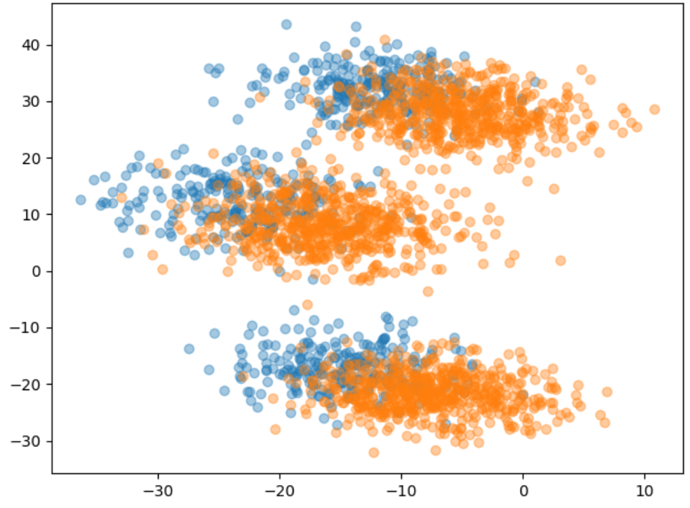
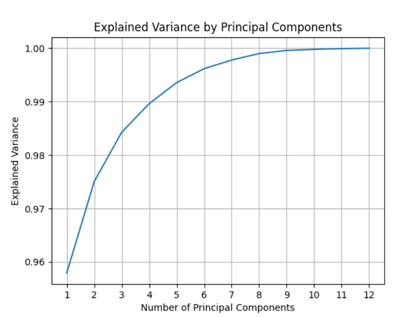
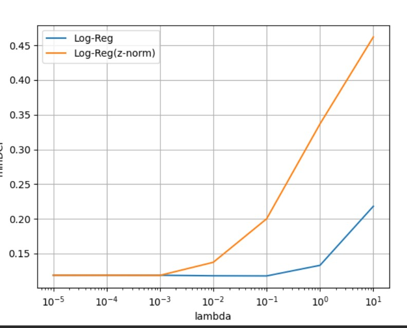
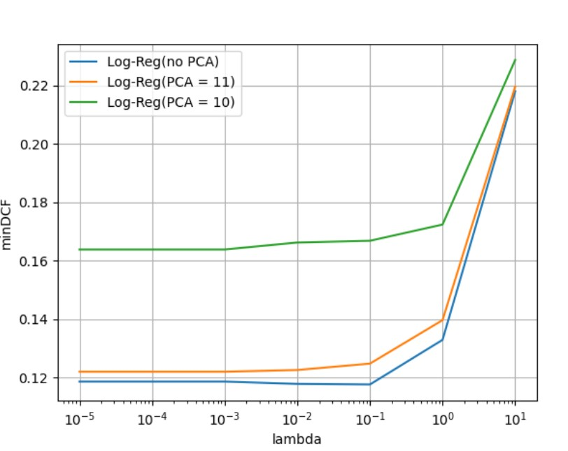
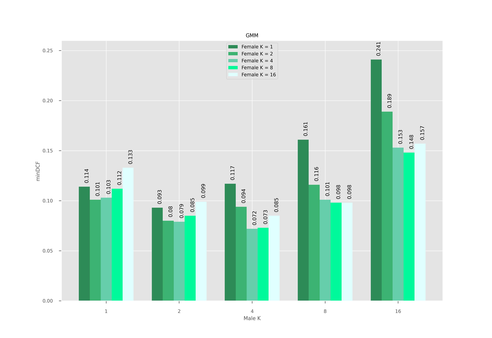

# GenderIdentification

# Introduction

This project is aiming to develop a classifier to distinguish the gender from 12-dimensional features.
Training set has 2400 samples, 720 of them are male(label = 0), the rest 1680 are female(label = 1).
According to the requirement, only one working point applied ($\pi$ = 0.5
Cfn=1 Cfp=1 ) 

# Feature

### Histogram and 2D scatter plots of dataset features - principal components

| 1st principle component | scatter of first two components |
|:-----------------------:|:-------------------------------:|
|  |          |
|                         |        |

### Histogram of dataset features - LDA direction

 - Gaussian may not sufficient for dividing the gender according to the observation from male and female's first principal component
 - LDA shows that a linear classifier may have potential to discriminate the classes. However, regarding the features we observed in scatter plot, no linear model, for example GMM model with 3 components maybe will exhibit better performance 

### Pearson correlation coefficient for the dataset features

|                            Dataset                             |                                  Male                                  | Female                                                                     |
|:--------------------------------------------------------------:|:----------------------------------------------------------------------:|:---------------------------------------------------------------------------|
|  |  |  |

Dark color implies larger value means high correlation between those two features.

From the graph, it shows some features are significantly have large correlation with others no matter in which gender group.

It means we may benefit from using PCA to map data to lower dimension, 
We use an explained variance graph as well to help us have better idea about suitable dimension could be retained.

### PCA_explained_variance

with 10 dimension we could explain about 99% of the dataset variance. 96% remains with 9 directions. 94% only when the dimension jumps into 8 direction.

To start, we will consider full dimension(12) to 8 dim for PCA.

# Building a classifier for the task

We have implemented K- fold protol with K = 5. We measure performance in terms of minimum costs( minDCF).
Then, We will assess the actual DCF( actual Cprim) and score calibration once we have chosen the top-performing model.

## Gaussian classifier
We test all three approaches(MVG, Naive Bayes model, Tied) also with the effect of PCA

### MVG classifier - minDCF(K-Fold) 
| PCA | minDCF( $\widetilde{\pi}$ = 0.5) | 
|:---:|:--------------------------------:|
|  -  |            **0.114**             |
| 11  |              0.124               | 
| 10  |              0 166               | 
|  9  |              0.190               | 
|  8  |              0.193               | 

When keeping all features in the dataset will keep a best performance

### Naive MVG classifier - minDCF(K-Fold) 
| PCA | minDCF( $\widetilde{\pi}$ = 0.5) | 
|:---:|:--------------------------------:|
|  -  |              0.463               |
| 12  |            **0.119**             |
| 11  |              0.123               | 
| 10  |              0 168               | 
|  9  |              0.195               | 
|  8  |              0.198               | 

It shows the performance is better when dimension is in original size and when reduce 1, it increases a little but is still in tolerance. However, when dimension comes to 10, the cost increase significantly.

### Tied MVG classifier - minDCF(K-Fold) 
| PCA | minDCF( $\widetilde{\pi}$ = 0.5) |
|:---:|:--------------------------------:|
|  -  |            **0.114**             |
| 11  |              0.118               | 
| 10  |              0.162               | 
|  9  |              0.186               |
|  8  |              0.189               | 

The Naive MVG shows the similar answer with MVG but this method reduce computational complexity.

## Logistic Regression classifier

We now consider Logistic Regression models. 
We start analyzing the linear classifier without PCA

### Logic Regression classifier - minDCF(K-Fold) 
| lambda | minDCF( $\widetilde{\pi}$ = 0.5) |
|:------:|:--------------------------------:|
| 1e-06  |              0.118               |
| 1e-05  |              0.118               | 
| 0.0001 |              0.118               | 
| 0.001  |            **0.118**             |
|  0.01  |              0.118               | 
|  0.1   |              0.118               |
|   1    |              0.133               | 
|   10   |              0.219               | 

It is surprise that the performance is not quite worse since minDCF can reach 0.118, it is better than MVG model

Then we could apply PCA to see whether it will improve our model .
Because the z-norm doesn't favor our model's performance, we will apply PCA on original data 

It can be seen that the result show worse result when we reduce the dimension, when it jumps to 10 , the cost increase dramatically.

Up to know, the best model is linear Regression with original PCA.

## Support Vector Machine
We move to SVM model, we try linear SVM firstly

1: no PCA 

|   C   | minDCF( $\widetilde{\pi}$ = 0.5) |
|:-----:|:--------------------------------:|
| 1e-05 |                1                 | 
| 1e-04 |              0.137               | 
| 0.001 |              0.120               |
| 0.01  |            **0.115**             | 
|  0.1  |              0.115               |
|   1   |              0.115               | 
|  10   |              0.115               | 

Then we try the kernel SVM, we start from polynomial kernels. Now we only consider original dimension (no PCA)

For Poly kernel

1 d =2 c = 0

|   C   | minDCF( $\widetilde{\pi}$ = 0.5) |
|:-----:|:--------------------------------:|
| 1e-05 |                1                 | 
| 1e-04 |              0.119               | 
| 0.001 |              0.131               |
| 0.01  |              0.127               | 
|  0.1  |            **0.115**             |
|   1   |              0.119               | 

For RBF
1  logGAMMA= -3  k=0

| log$\gamma$ | minDCF( $\widetilde{\pi}$ = 0.5) |
|:-----------:|:--------------------------------:|
|     -3      |               0.2                | 
|     -4      |              0.228               | 
|     -5      |              0.306               |
 

## Gaussian Mixture Models
We assume male and female training data both have different components [1,2,4,8,16]. we tried different combination. Because a dimension reduction doesn't bring a good result. we will only try original data

Since we found Tied Gaussian has a good performed in MVG models, so we will mainly consider Full Covariance(FC) and Ties(T) models.
And from the above graph, we notice that the candidate components number would be 2 and 4 in male data. 4 and 8 in female data. so we tried different combination to find a better solution 

| Male K | Female K | minDCF( $\widetilde{\pi}$ = 0.5) | 
|:-------|:---------|:--------------------------------:|
| 2(T)   | 4(FC)    |              0.103               |
| 2(T)   | 8(T)     |              0.101               |
| 2(D-T) | 4(FC)    |              0.221               |
| 2(D-T) | 8(FC)    |              0.223               |
| 2(FC)  | 4(FC)    |            **0.079**             |
| 2(FC)  | 4(T)     |              0.083               |
| 2(FC)  | 8(FC)    |              0.085               |
| 2(FC)  | 8(T)     |              0.083               |
| -----  | -------- |            ----------            |
| 4(D-T) | 4(FC)    |              0.126               |
| 4(D-T) | 8(T)     |              0.127               |
| 4(T)   | 4(FC)    |              0.073               |
| 4(T)   | 4(T)     |            **0.070**             |
| 4(T)   | 8(FC)    |              0.078               |
| 4(T)   | 8(T)     |              0.073               |
| 4(FC)  | 4(FC)    |            **0.072**             |
| 3(T)   | 4(T)     |              0.071               |

It can be seen that if male and female data are both divided into 4 components, with Tied model . the minDCF is lowest which is a rather better solution. 
Tied model has this outstanding solution means all the features in our dataset have a similar distribution. On the other side, if diagonal applied, it represents worse result . It means features may depend on each other which is also align with out analysis in heatmap.
Finally, we apply the Znorm on the data and implement on our best model: 4(T) for male and female, we get the minDCF which shows a little improved(0.067) 

Finally, we selected 4(T) -4(T) as our best model in GMM and data applied will be Znorm

## Calibration and fusion
We use the DET plot to compare the best models that we collect from now.
It can be seen that....
# Experimental Evaluation
now we analyze a model performance on the evaluation set. We start from the selected model and then different choices will be analyzed as well

Only min and actual Cprim costs

# Conclusion

