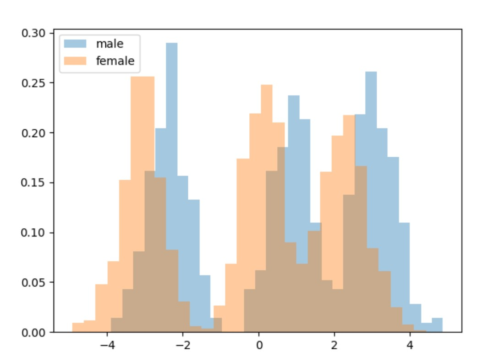
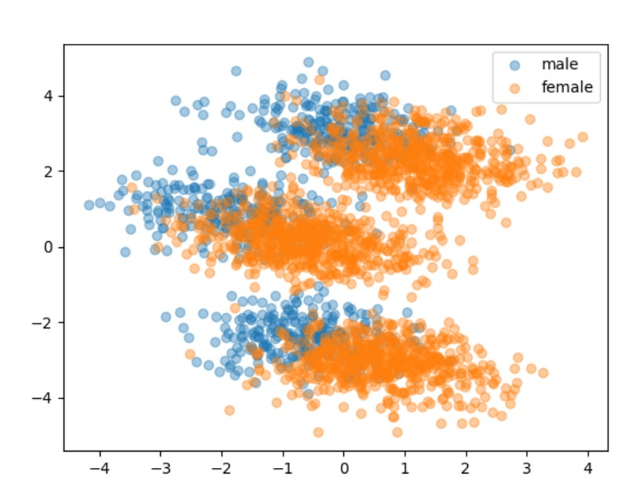
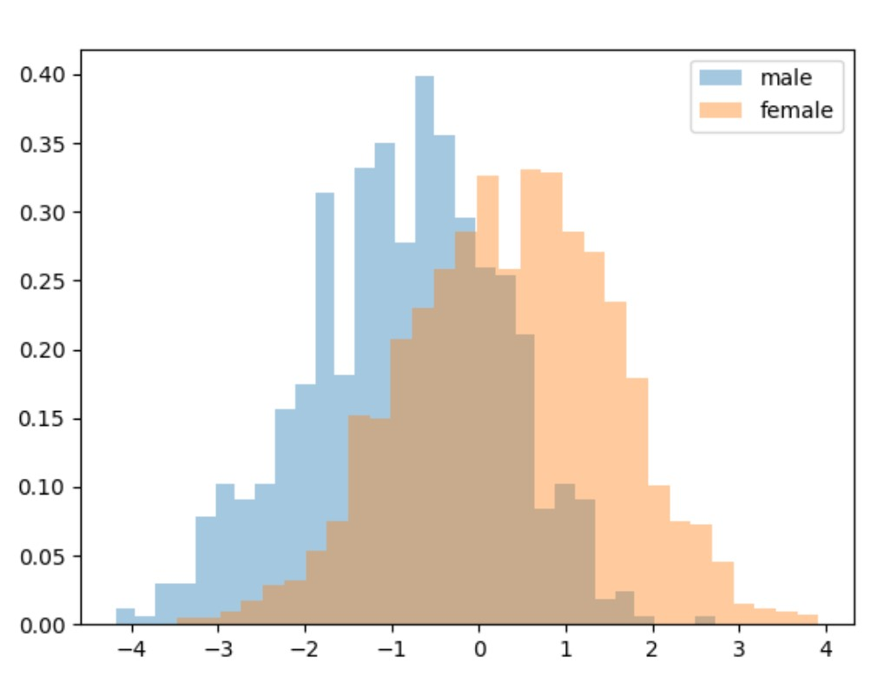
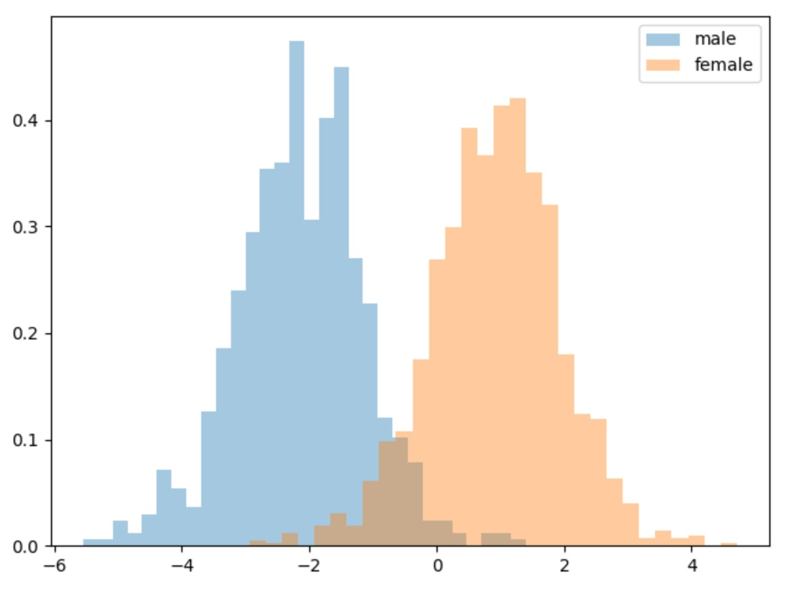
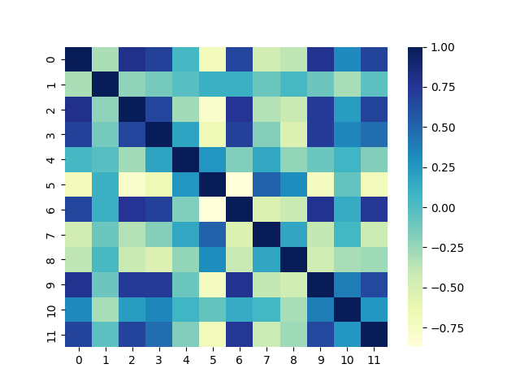
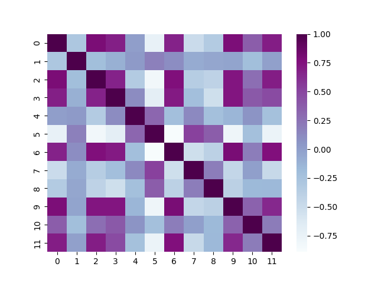
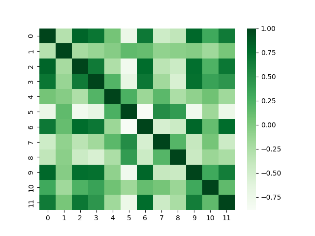
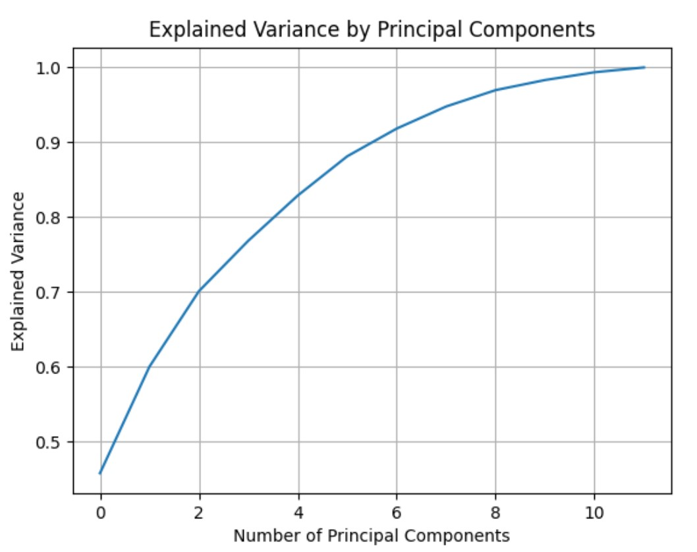

# GenderIdentification

# Introduction

This project is aiming to develop a classifier to distinguish the gender from 12-dimensional features.
Training set has 2400 samples, 720 of them are male, the rest 1680 are female.
Expect woking point provided ($\pi$ = 0.5
Cfn=1 Cfp=1 ) , another woking point are also into considered($\pi$ = 0,1 Cfn=1 Cfp=1)

# Feature

label = 1 female
label = 0 male
### Histogram and 2D scatter plots of dataset features - principal components

| 1st principle component | scatter of first two components |
|:-----------------------:|:-------------------------------:|
|  |      |
|                         |        |

### Histogram of dataset features - LDA direction

 - LDA shows a linear classifier may be able discriminate the classes 
### Histogram of dataset features - LDA direction

 - Gaussian may not sufficient for dividing the gender according to the observation from its first principal component
 - LDA shows that a linear classifier may be able to discriminate the classes to some degree, but, regarding the features we observed in scatter plot, no linear models (eg,GMM ) will have better performance 

### Pearson correlation coefficient for the dataset features

|          Dataset          |             Male              | Female                          |
|:-------------------------:|:-----------------------------:|:--------------------------------|
|  |  |  |

Dark color implies larger value means high correlation between those two features.
From the graph, we can found that no matter each gender, some features are significantly have large correlation with others.
It means we may benefit from using PCA to map data to xx, But an explained variance will also draw below to pick a suitable left dimension number
5
### PCA_explained_variance

with 10 dimension we could explain about 99% of the dataset variance. 97% with 8 directions 91% with 6 directions. To start, we will consider these three values for PCA.

# Building a classifier for the task

We adopt K- fold protol with K = 5. We measure performance in terms of minimum costs.
Since two working points are considered, we compute the minDCF of both working points and their average (Cprim)

We will assess the actual DCF( actual Cprim) and score calibration once we have selected the top-performing model

## Gaussian classifier

### MVG classifier - minDCF(K-Fold) 
| PCA | minDCF( $\widetilde{\pi}$ = 0.5) | 
|:---:|:--------------------------------:|
|  -  |              0.144               | 
| 11  |            **0.136**             |
| 10  |              0 189               | 
|  8  |              0.261               | 
|  6  |              0.282               | 

11 dimension looks have the best performance among them

### Tied MVG classifier - minDCF(K-Fold) 
| PCA | minDCF( $\widetilde{\pi}$ = 0.5) | 
|:---:|:--------------------------------:|
|  -  |            **0.127**             |
| 11  |              0.129               | 
| 10  |              0 187               | 
|  8  |              0.257               | 
|  6  |              0.278               | 

### Naive MVG classifier - minDCF(K-Fold) 
| PCA | minDCF( $\widetilde{\pi}$ = 0.5) |
|:---:|:--------------------------------:|
|  -  |              0.456               |
| 11  |            **0.136**             | 
| 10  |              0.184               | 
|  8  |              0.257               |
|  6  |              0.277               | 

The Naive MVG shows the similar answer with MVG but this method reduce computational complexity

## Logistic Regression classifier

### Logic Regression classifier - minDCF(K-Fold) 
| lambda | minDCF( $\widetilde{\pi}$ = 0.5) |
|:------:|:--------------------------------:|
| 1e-06  |              0.118               |
| 1e-05  |              0.118               | 
| 0.0001 |              0.117               | 
| 0.001  |              0.124               |
|  0.01  |              0.145               | 
|  0.1   |              0.200               |
|   1    |              0.337               | 
|   10   |              0.460               | 
## Support Vector Machine
## Gaussian Mixture Models

## Calibration and fusion
# Experimental Evaluation
now we analyze a model performance on the evaluation set. We start from the selected model and then different choices will be analyzed as well

Only min and actual Cprim costs

# Conclusion

